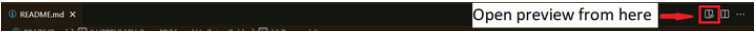
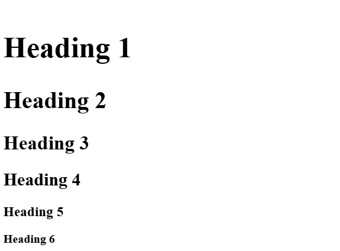
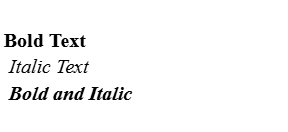
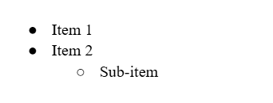
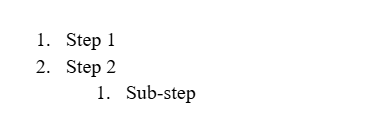
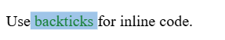
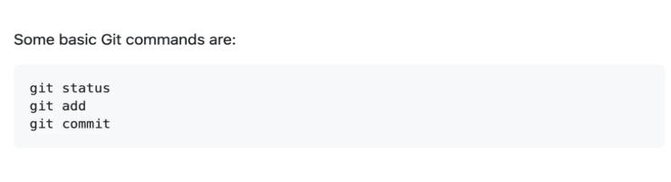
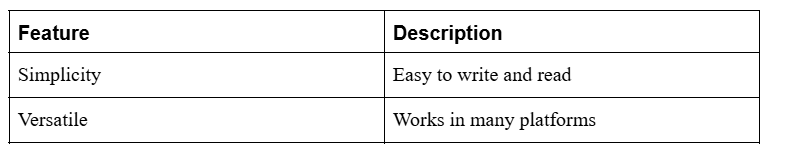
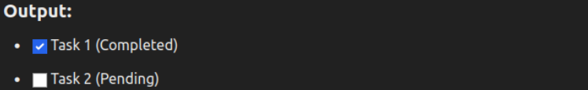
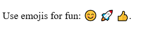

# Markdown Tutorial (Readme.md)

By Moazzam Ali and Muhammad Ramzan

* * *

##

  1. Markdown

Markdown is a lightweight markup language used to format text. Its primary
purpose is to make writing and reading formatted documents simple, especially
for documentation, readmes, and technical content.

**File Extension:** Markdown files typically have the extension .md or
.markdown

**Common Use Cases:**

     * Documentation: Describing how a project works.
     * Readmes: Providing an overview of a repository.
     * Changelogs: Tracking changes in projects.
     * Wikis: Collaborative project documentation.

**Open Preview in VS-code:**

When you open the readme or markdown file in the VS-code, in the top right
side of VS-code you can see such an icon, click on icon readme file preview
will be opened.




##

  2. Headings

**Example:**

To create a heading, add one to six # symbols before your heading text. The
number of # you will determine the hierarchy level and typeface size of the
heading.

    
    # Heading 1
    ## Heading 2
    ### Heading 3
    #### Heading 4
    ##### Heading 5
    ###### Heading 6
            

**Output:**



##

  3. Paragraphs

**Example:**

    
    This is a paragraph.
    
    
    Leave a lank line to separate paragraphs.
            

**Output:**


##

  4. Text Styles

**Example:**

    
    **Bold Text** 
    *Italic Text* 
    ***Bold and Italic***

**Output:**



##

  5. Lists

**Unordered List:**

    
    - Item 1
    - Item 2
    - Sub-item

**Output:**



**Ordered List:**

    
    1. Step 1
    2. Step 2
      1. Sub-step

**Output:**



##

  6. Code Blocks

**Inline Code:**

    
    Use `backticks` for inline code.

**Output:**



**Quoting code:**

    
    Some basic Git commands are:
    ```
    git status
    git add
    git commit
    ```
            

**Output:**



##

  7. Links

**Example:**

    
    [Visit GitHub](https://github.com)

**Output:**


##

  8. Images

**Example:**

    
    
    
    
    
                
                
    <p align="center">
    
    </p>
            

**Output:**


##

  9. Tables

**Example:**

    
    | Feature    | Description             |
    |------------|-------------------------|
    | Simplicity | Easy to write and read  |
    | Versatile  | Works in many platforms |
            

**Output:**



##

  10. Checklists

**Example:**

    
    - [x] Task 1 (Completed)
    - [ ] Task 2 (Pending)
            

**Output:**



##

  11. Emojis

**Example:**

    
    Use emojis for fun: :smile: :rocket: :+1:

**Output:**



## Reference:

  * <https://docs.github.com/en/get-started/writing-on-github/getting-started-with-writing-and-formatting-on-github/basic-writing-and-formatting-syntax#styling-text>
  * <https://www.markdownguide.org/basic-syntax/#code>

