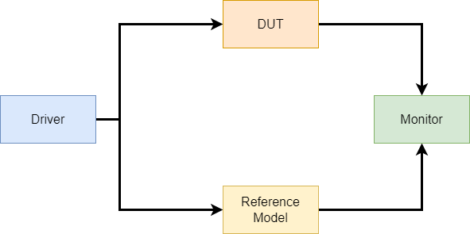

# Self-Testing Testbench

Verification is a critical process in hardware design to ensure systems operate as intended. This tutorial covers both combinational and sequential logic verification techniques.

## Verification Methodologies

### Manual Testing  
Traditional approach where engineers interact with the design manually to verify its functionality.

### Self-Testing (Automated)  
Advanced methodology using built-in test mechanisms. A self-testing testbench automates the verification process by generating inputs and checking outputs against expected values without requiring manual inspection. This is essential for verifying designs like register files or arithmetic circuits.

## Testbench Components  
There are a few components required to create a self-testing testbench as shown below:  

  

- **Driver**: Generates and applies inputs  
- **Monitor**: Observes and verifies outputs  
- **Reference Model**: Golden model for comparison  

## Tasks vs Functions

### Tasks  
A task is a reusable block of code that may consume simulation time and does not return a value. Tasks can include timing controls (`#`, `@`, wait), making them useful for sequential logic, delays, or testbench interactions.

```systemverilog
task add(input logic [7:0] x, y, output logic [7:0] result);
   @(posedge clk);
   result = x + y;
endtask
```

### Functions  
A function is a reusable block of code that executes in zero simulation time and returns a single value. Functions cannot contain timing controls (`#`, `@`, wait), making them suitable for combinational logic and computations.

```systemverilog
function logic [7:0] add_numbers(input logic [7:0] x, y);
   return x + y;
endfunction
```

| **Feature**       | **Tasks**              | **Functions**          |
|-------------------|-----------------------|-----------------------|
| Timing controls   | Allowed               | Not allowed           |
| Return values     | No                    | Single value          |
| Execution time    | May consume time      | Zero-time             |
| Typical use       | Test sequences        | Calculations          |

## Test Strategies  
There are many types of tests that could be performed on a DUT, but general form of tests applied on any design to verify its integrity are:

### Directed Tests  
Specific scenarios or conditions designed to test particular features or functions. In Directed Tests, the inputs are generally fixed and decided by the tester.

### Random Tests  
Randomly generated inputs to explore a wide range of scenarios, increasing coverage.

### Edge Case Tests  
Tests focused on boundary or extreme conditions to ensure robustness and reliability.

### Torture Tests  
A torture test is an extreme stress test designed to push a system, component, or device to its absolute limits to evaluate its durability, stability, and performance under harsh conditions. In that case, the module is tested for all the combinations possible.

## Building Self Testing Testbench from a basic Testbench  
Below is a simple initial block to write to a register file:

```systemverilog
initial begin
  address <= 0;
  clock <= 0;
  en_write <= 1;
  dreg <= 0;

  @(posedge clock);
  address <= #1 0;
  dreg <= #1 0;
  en_write <= #1 1;

  @(posedge clock);
  en_write <= #1 0;

  @(posedge clock);
  address <= #1 1;
  dreg <= #1 1;
  en_write <= #1 1;

  @(posedge clock);
  en_write <= #1 0;

  repeat(2) @(posedge clock);
  $stop;
end
```

### Reusable Task for Write Operations  
We can use tasks to modularize write operations:

```systemverilog
task memwrite(input [7:0] addr, input [7:0] data);
begin
  @(posedge clock);
  address <= #1 addr;
  dreg <= #1 data;
  en_write <= #1 1;

  @(posedge clock);
  en_write <= #1 0;
end
endtask
```

Using the task in the initial block:

```systemverilog
initial begin
  address <= 0;
  clock <= 0;
  en_write <= 1;
  dreg <= 0;

  memwrite(0, 0);
  memwrite(1, 1);
  memwrite(2, 2);

  repeat(2) @(posedge clock);
  $stop;
end
```

### Using Random Inputs  
To improve test coverage, use random values:

```systemverilog
initial begin
  address <= 0;
  clock <= 0;
  en_write <= 1;
  dreg <= 0;

  memwrite(0, $random);
  memwrite(1, $random);
  memwrite(2, $random);

  repeat(2) @(posedge clock);
  $stop;
end
```

### Looping Over Inputs  
You can use loops to apply tasks repeatedly:

```systemverilog
integer ii;
initial begin
  address <= 0;
  clock <= 0;
  en_write <= 1;
  dreg <= 0;
  for (ii = 0; ii < 10; ii = ii + 1) begin
    memwrite(ii, $random);
  end
  repeat(2) @(posedge clock);
  $stop;
end
```

## Examples of Self-Checking Testbench

### GCD  
```systemverilog
task reset_sequence;
begin
  reset = 0;
  @(posedge clk) reset = #1 1;
  @(posedge clk) reset = #1 0;
end
endtask

task apply_inputs(input [7:0] ar, br);
begin
  a = ar;
  b = br;
  validin = 0;
  @(posedge clk); validin = #1 1;
  @(posedge clk); validin = #1 0;
end
endtask

function [7:0] gcdref(input [7:0] a, b);
begin
  while (a != b) begin
    if (a < b) b = b - a;
    else       a = a - b;
  end
  gcdref = a;
end
endfunction

initial begin
  clk = 0;
  forever #10 clk = ~clk;
end

initial begin
  reset_sequence;
  repeat (5) begin
    a = $random; b = $random;
    apply_inputs(a, b);
    @(posedge validout);
    if (gcdref(a, b) == c)
      $display("Success: GCD is %d", c);
    else
      $display("Error: a=%d, b=%d, expected=%d, got=%d", a, b, gcdref(a, b), c);
    repeat(2) @(posedge clk);
  end
  $stop;
end
```

### Combinational 16x16 Multiplier  
```systemverilog
// Driver for multiplier
task driver(logic signed [15:0] a = $random, b=$random);
           A = a;
           B = b;
           #10;       // Wait for some time
endtask

// Monitor for multiplier
task monitor();
   logic signed [15:0] M_A;
   logic signed [15:0] M_B;
   logic signed [31:0] expected_product;
   begin
       M_A = A;
       M_B = B;

       // Reference Model
       expected_product = M_A * M_B;

       // Compare the result
       if (Product !== expected_product)
       begin
          $display("ERROR: A=%d, B=%d, Expected Product=%d, Got=%d, time=%t",
          M_A, M_B, expected_product, Product , $time);
          $finish;
       end
       else
       begin
         $display(" PASS: A=%d, B=%d, Product=%d",M_A, M_B, Product);
       end   
  end
endtask

task diect_test(logic signed [15:0] a, b);
   begin
       driver(a, b);
       monitor();
   end
 endtask

task random_test(input int n);
   for(int i=0 ; i<n; i++)
   begin
       driver($random, $random);
       monitor();
   end
endtask
```

## Best Practices  
- Use tasks for complex test sequences  
- Implement reference models in functions  
- Combine directed and random testing  
- Automate result checking  
- Use loops for repetitive tests

 
